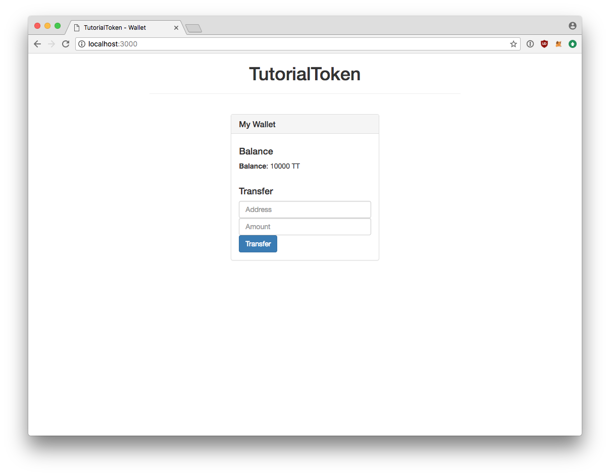
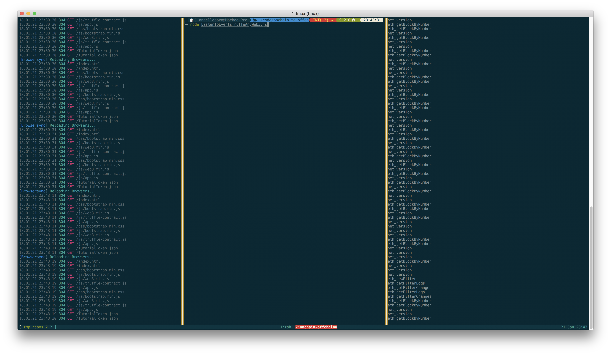
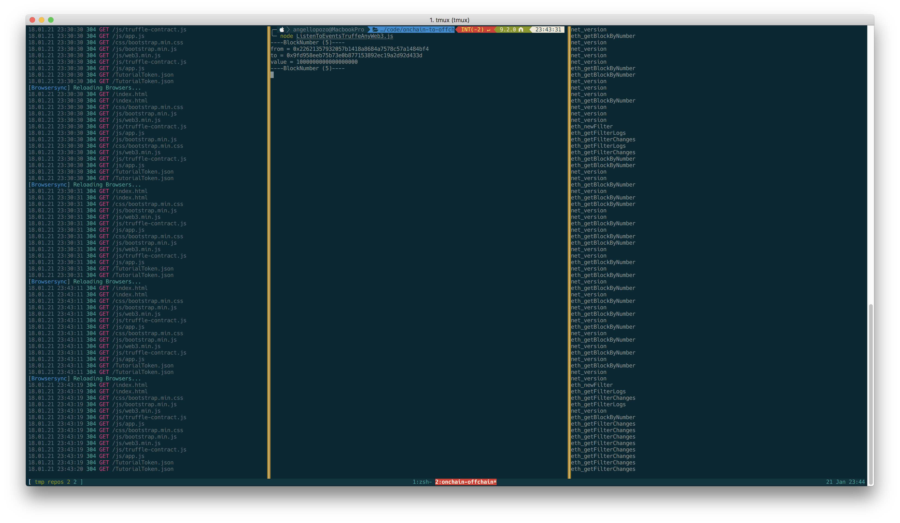

## Purpose

An example repo of that shows how to connect an offchain service to Ethereum (onchain). This repo was created to compliment [this blog post](https://medium.com/hello-sugoi/ethereum-communicating-with-the-off-chain-world-789fea13163b).

## Prerequisites

1. Node > 7.6, Preferably node 8
2. [Ganache-cli](https://github.com/trufflesuite/ganache-cli/releases/tag/v7.0.0-beta.0) V7 Beta
3. Truffle 4.0.0 or greater
4. Chrome with [Metamask](https://metamask.io/) installed

## Getting Started

To get started you will need to clone this repo, install dependencies, deploy contracts to the beta version of ganache-cli, and then start the npm server. Lastly you will need to add the first account from ganache-cli into Metamask.
Please follow the instructions below:

#### Terminal 1
  1. ganache-cli

With the output, copy the first private key in the list. Open the chrome browser, and click on the Metamask icon. On the top right, click the icon with the circle around the person, then click import account. Paste in the private key you copied and continue. Lastly, you will need to change the network Metamask is listening to. Click Metamask again, on the top left click on the network, a drop down should appear. Select the `localhost:8545` network.

#### Terminal 2
  1. git clone \<repo>
  2. cd \<repo>
  3. npm install
  4. truffle migrate
  5. npm run dev

Once you have everything done, you can go to `localhost:3000` and see a dialogue as shown below.



## Procedure

As part of this tutorial, I created 3 different samples. The first is `ListenToEventsTruffeAnyWeb3.js`, where you can listen to events using truffle to listen to events. The second is `ListenToEventsWeb3-0-20-4.js` that listens to events using the web3 javascript codebase. It should also work for older version of web3, aka less than 0.20.4. Laslty, I have `ListenToEventsWeb3-1-0-0-beta.js` which uses the newer Web3 1.0.0beta-27 version. There will be a section below that shows you how to make it work with this repo.

#### Terminal 3
1. node ListenToEventsTruffeAnyWeb3.js

Just to recap, there should be 3 terminals running at the same time. The first is `ganache-cli`, the second is `npm run dev`, and now the `ListenToEventsTruffeAnyWeb3.js` terminal. Similar to what is shown below.




Once everything is running, we can go back to `localhost:3000` and fill out the webform. Enter an address and an amount into the webform. I put `0x9fd958eeb75b73e0b877153892ec19a2d92d433d` and `1000000000000000000`. Please note, that the amount is in Wei, so if you want to send a whole token use the value I provided. Click the `Transfer` button, and metamaks will open. Accept the transaction and look at your terminal. The transaction will pop open.




You should notice an output of:

```
----BlockNumber (5)----
from = 0x22621357932057b1418a8684a7578c57a1484bf4
to = 0x9fd958eeb75b73e0b877153892ec19a2d92d433d
value = 1000000000000000000
----BlockNumber (5)----
```

The values should be whatever you put into the webform. The one difference would be the `from` address. Now keep doing more transactions and they should appear as they are accepted into the blockchain.


### Using Web3 1.0.0-beta27

This is not specific to beta27, but just about any web3 1 version. You need to override the currently installed version of web3.

1. npm install web3@1.0.0-beta27

Once that is installed, you should be able to run `node ListenToEventsWeb3-1-0-0-beta.js` and see events. You can also try out `node ListenToEventsTruffeAnyWeb3.js`. It will work with any verion of web3.